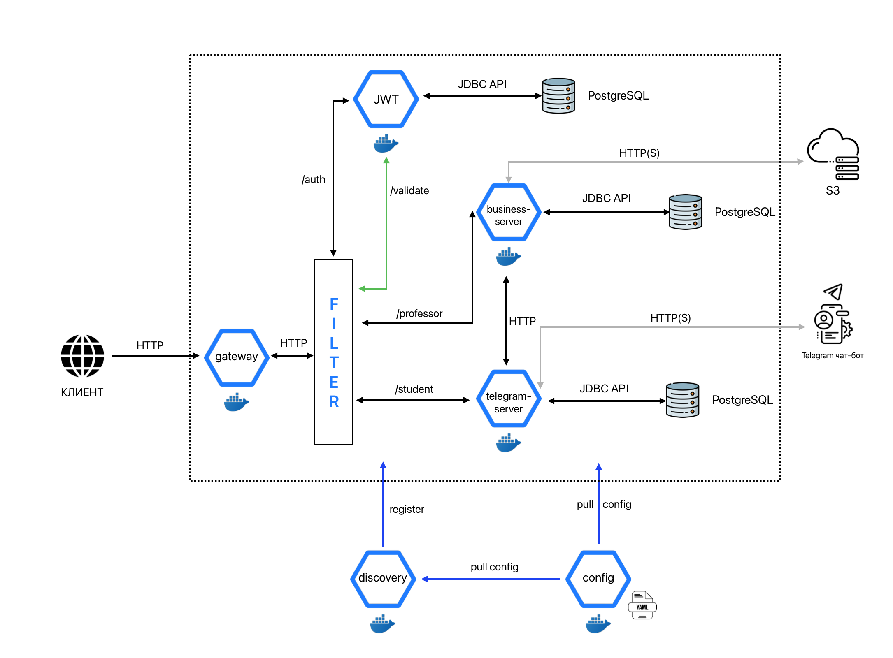
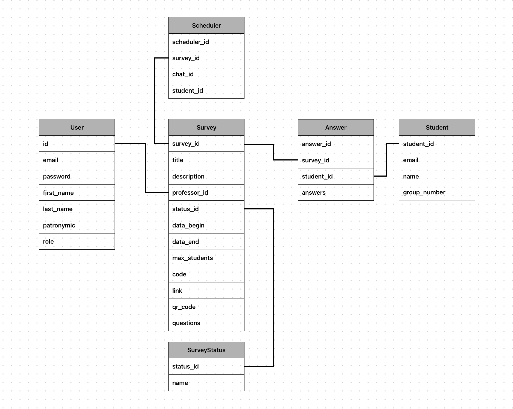
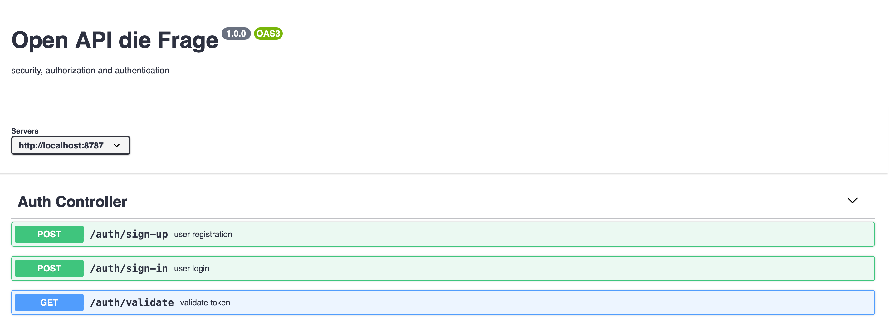
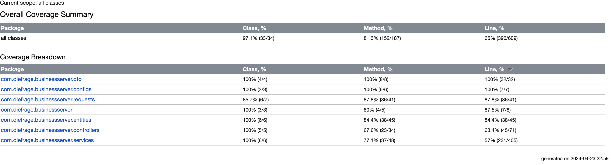

# Проект "Die Frage"

## 1. Архитектура проекта

Проект "Die Frage" разработан с использованием следующих технологий и подходов:
- Spring Boot - фреймворк для создания Java приложений
- Spring Cloud - набор инструментов для построения микросервисных архитектур
- Микросервисная архитектура используется для улучшения масштабируемости и гибкости приложения


## 2. Используемые технологии
Проект "Die Frage" разработан с использованием следующих технологий:  


## 3. Структура проекта

Проект состоит из 8 приложений, каждое из которых выполняет определенную функцию:

1. **config-server** - предназначен для управления конфигурациями в микросервисной архитектуре.  
2. **discovery** - service discovery (обнаружение сервисов) для микросервисов.  
3. **gateway** - шлюз API упрощающий связь между клиентом и сервером.  
4. **auth-server** - для создания и проверки JWT-токенов используется централизованный сервер аутентификации и авторизации.  
5. **business-server** - Представляет собой приложение реализующее бизнес логику приложения, crud данных об опросах, пользователях и ответах.  
6. **telegram-server** - Представляет собой приложение-планировщик, отсылает запросы в телеграмм-бот.  

Модуль **exceptions** - реализован в качестве библиотеки, который подключается через зависимости в остальные модули.


Схема архитектуры приложения:  
  


Порты для доступа к приложениям:
- 8888: [config-server](http://localhost:8888)
- 8761: [discovery](http://localhost:8761)
- 8787: [gateway](http://localhost:8787)
- 8010: [auth-server](http://localhost:8010)
- 8050: [business-server](http://localhost:8050)
- 8060: [telegram-server](http://localhost:8050)

## 4. База данных

Проект использует PostgreSQL. Подключение осуществляется по адресу `jdbc:postgresql://localhost:5432`.

Название базы данных: fragedb  

Схема базы данных:  




Для корректной работы микросервисов требуется настройка конфигурационных файлов в папке `resources/configurations`. Важно, чтобы название файла совпадало с названием модуля микросервиса. Например, конфигурационный файл для микросервиса business-server может иметь следующий вид:

### student.yml:

```yaml
eureka:
  instance:
    hostname: localhost
  client:
    service-url:
      defaultZone: http://localhost:8761/eureka/

server:
  port: 8050
spring:
  application:
    name: business-server

datasource:
  driver-class-name: org.postgresql.Driver
  url: jdbc:postgresql://localhost:5432/fragedb
  username: postgres
  password: postgres
  jpa:
    database: postgresql
    hibernate:
      ddl-auto: update
    show-sql: true
  properties:
    hibernate:
      dialect: org.hibernate.dialect.PostgreSQLDialect
```
## 5. Запуск проекта 

Проект собирается с помощью команды из корневой директории проекта:

```bash
mvn clean install
```

Пример запуска микросервиса:  
```bash
java -jar die-frage-api/config-server/target/*.jar
```


## 6. OPEN API

Swagger используется для документирования API и упрощения тестирования запросов. Спецификации для endpoints находятся в следующих директориях:

- **[student](student/src/main/resources/specification.yml)**: `student/src/main/resources/`
- **[professor](professor/src/main/resources/specification-prof.yaml)**: `professor/src/main/resources/`
- **[survey](survey/src/main/resources/specification-survey.yaml)**: `survey/src/main/resources/`
- **[auth-server](auth-server/src/main/resources/specification.yml)**: `auth-server/src/main/resources/`

Пример:  




## 7. Тестирование

Интеграционное тестирование проводилось с помощью: **jupiter** - наиболее широко используемая среда тестирования для приложений Java.  

Отчет:  

